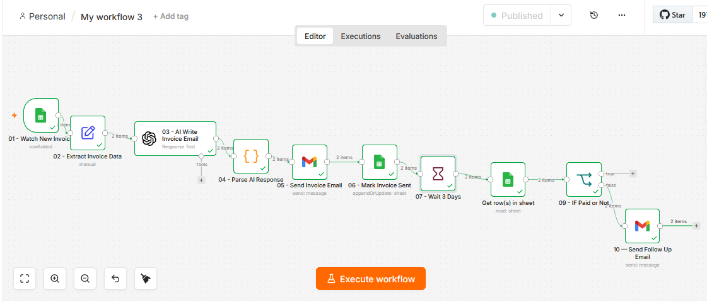

# AI Invoice + Follow Up System — n8n Workflow

Every freelancer and small business loses money not because they do bad work — but because they forget to follow up on unpaid invoices. Someone finishes a project, sends an invoice, and then feels too awkward to chase the client. The payment never comes.

This workflow sends the invoice automatically the moment a new client is added. Three days later, if the client has not paid, a friendly reminder goes out on its own. Everything is tracked in a spreadsheet. No awkward chasing. No forgotten invoices. No lost money.

---

## Live Demo



---

## Who This Is For

- Freelancers who invoice clients manually and forget to follow up
- Small agencies tired of chasing payments
- Consultants who lose money because of slow collections
- Any service business that sends invoices and waits too long for payment

---

## What It Does

- Client fills a Google Form with their details
- Invoice email gets sent automatically within 1 minute
- Sheet gets updated — Invoice Sent = Yes
- Workflow waits 3 days
- Checks if client has paid
- If paid — stops. No unnecessary emails.
- If unpaid — sends a warm friendly reminder automatically
- Everything tracked in Google Sheets in real time

---

## Stack

| Tool | Role |
|------|------|
| Google Form | Collect client and invoice details |
| Google Sheets | Track invoice and payment status |
| n8n | Run the entire automation |
| OpenAI GPT-4o-mini | Write professional invoice and follow up emails |
| Gmail | Send invoice and reminder emails |

---

## Workflow Architecture

```
Client fills Google Form
          ↓
01 - Watch New Invoice
     Detects new form submission every 1 minute
          ↓
02 - Extract Invoice Data
     Cleans client name, email, service, amount, due date
          ↓
03 - AI Write Invoice Email
     GPT-4o-mini writes a professional invoice email
          ↓
04 - Parse AI Response
     Extracts subject and body from AI output
     Combines all data into one clean package
          ↓
05 - Send Invoice Email
     Sends invoice to client via Gmail
          ↓
06 - Mark Invoice Sent
     Updates Sheet — Invoice Sent = Yes
          ↓
07 - Wait 3 Days
     Workflow pauses for 3 days
          ↓
08 - Check Payment Status
     Reads fresh data from Sheet
          ↓
09 - IF Paid or Not
     Paid = workflow stops
     Unpaid = follow up sent
          ↓
10 - Send Follow Up Email
     Friendly reminder sent to client
```

---

## Node Configuration

### 01 — Watch New Invoice

Watches the Google Sheet every 60 seconds.
Fires the workflow the moment a new form response appears.

```
Type      : Google Sheets Trigger
Trigger On: Row Added
Sheet     : Form Responses 1
Poll Time : Every 1 Minute
```

---

### 02 — Extract Invoice Data

Pulls clean data from the raw Form response.
Sets default values for tracking fields.

```
Type : Edit Fields (Set)
Mode : Manual Mapping

client_name    → {{ $json['Client Name'] }}
client_email   → {{ $json['Client Email'] }}
service        → {{ $json['Service Description'] }}
amount         → {{ $json['Invoice Amount ($)'] }}
due_date       → {{ $json['Payment Due Date'] }}
status         → Unpaid
invoice_sent   → No
follow_up_sent → No
```

---

### 03 — AI Write Invoice Email

GPT-4o-mini reads the client details and writes a professional invoice email.

```
Type      : OpenAI
Model     : GPT-4o-mini
Operation : Message a Model
```

**System Prompt:**
```
You are a professional billing assistant.

Your job is to write a warm, professional
invoice email to a client.

RULES:
- Address the client by first name
- Mention the service clearly
- Mention the amount clearly
- Mention the due date clearly
- Sound professional but friendly
- Not too long — keep it clean
- End with a thank you

RESPONSE FORMAT:
Return ONLY a valid JSON object. Nothing else.

{
  "subject": "<email subject line>",
  "body"   : "<full email body>"
}
```

**User Message:**
```
Client Name : {{ $json.client_name }}
Service     : {{ $json.service }}
Amount      : ${{ $json.amount }}
Due Date    : {{ $json.due_date }}

Write a professional invoice email.
```

---

### 04 — Parse AI Response

Extracts subject and body from AI output.
Combines everything into one clean package for all following nodes.

```
Type    : Code Node
Language: JavaScript
Mode    : Run Once for All Items
```

```javascript
const items = $input.all();
const results = [];

for (const item of items) {

  const rawText = item.json.output[0].content[0].text;
  const parsed = JSON.parse(rawText);

  const node02 = $('02 - Extract Invoice Data');

  results.push({
    json: {
      client_name   : node02.item.json['Client Name'],
      client_email  : node02.item.json['Client Email'],
      service       : node02.item.json['Service Description'],
      amount        : node02.item.json['Invoice Amount ($)'],
      due_date      : node02.item.json['Payment Due Date'],
      status        : node02.item.json.status,
      invoice_sent  : node02.item.json.invoice_sent,
      follow_up_sent: node02.item.json.follow_up_sent,
      subject       : parsed.subject,
      body          : parsed.body
    }
  });
}

return results;
```

---

### 05 — Send Invoice Email

Sends the AI written invoice email to the client.

```
Type    : Gmail — Send Email
To      : {{ $json.client_email }}
Subject : {{ $json.subject }}
Message : {{ $json.body }}
```

---

### 06 — Mark Invoice Sent

Updates the Sheet to show the invoice has been sent.

```
Type                : Google Sheets — Update Row
Sheet               : Form Responses 1
Column to match on  : Client Email
Client Email value  : {{ $('04 - Parse AI Response').item.json.client_email }}

Fields to update:
Invoice Sent → Yes
```

> After Gmail Send node, $json loses all workflow data.
> Always reference Node 04 directly using:
> $('04 - Parse AI Response').item.json.client_email

---

### 07 — Wait 3 Days

Pauses the workflow for 3 days.
n8n keeps the execution in memory and resumes automatically.

```
Type  : Wait
Resume: After Time Interval
Amount: 3
Unit  : Days
```

> For testing use 1 Minute. Change to 3 Days for production.

---

### 08 — Check Payment Status

Reads fresh data from the Sheet after the 3 day wait.
Owner may have manually marked the invoice as Paid during this time.

```
Type               : Google Sheets — Get Row
Sheet              : Form Responses 1
Column to match on : Client Email
Value              : {{ $('04 - Parse AI Response').item.json.client_email }}
```

---

### 09 — IF Paid or Not

Checks the current Status from the Sheet.
Paid = workflow ends. Unpaid = follow up sent.

```
Type         : IF Node
Value 1      : {{ $json.Status }}
Operation    : Equal
Value 2      : Paid
Convert types: ON
```

```
True Branch  → Paid → Workflow stops
False Branch → Unpaid → Follow up email sent
```

---

### 10 — Send Follow Up Email

Sends a warm friendly reminder to the client.
Designed to feel human — not like an automated chase.

```
Type    : Gmail — Send Email
To      : {{ $('04 - Parse AI Response').item.json.client_email }}
Subject : Friendly Reminder — Invoice for {{ $('04 - Parse AI Response').item.json.service }}
```

**Email Body:**
```
Hi {{ $('04 - Parse AI Response').item.json.client_name }},

I hope you are doing well!

This is a friendly reminder that your invoice
for {{ $('04 - Parse AI Response').item.json.service }}
amounting to ${{ $('04 - Parse AI Response').item.json.amount }}
was due on {{ $('04 - Parse AI Response').item.json.due_date }}.

If you have already made the payment,
please ignore this message.

If you have any questions, feel free to reach out.

Thank you for your continued trust in our services!

Best regards,
Your Team 🙏
```

---

## Google Form Setup

```
Title: Invoice Request Form

Questions:
Q1: Client Name — Short answer
Q2: Client Email — Short answer
Q3: Service Description — Paragraph
Q4: Invoice Amount ($) — Short answer
Q5: Payment Due Date — Date
```

---

## Google Sheets Setup

```
Spreadsheet: Invoice Request Form (Responses)
Sheet: Form Responses 1

Columns added manually:
G: Status — tracks Unpaid / Paid
H: Invoice Sent — tracks Yes / No
I: Follow Up Sent — tracks Yes / No
```

---

## Important Notes

**Double row problem**
Never write to the Form Response Sheet from n8n.
Google Form already writes there automatically.
n8n writing there too causes every lead to appear twice.
Use a separate sheet for any n8n writes.

**Data loss after Gmail Send node**
After Node 05, $json loses all workflow data.
Always reference Node 04 directly:
```
$('04 - Parse AI Response').item.json.client_email ✅
$json.client_email ❌
```

**Data loss after Wait node**
Same rule applies after Wait node.
$json does not persist through a Wait.
Always reference the last data node by name.

**Convert types in IF node**
Always turn on Convert types in IF node settings.
Without it, string values cannot be compared to text values reliably.

**OpenAI response path**
```
Correct → output[0].content[0].text
Wrong   → message.content
```

**Wait node for testing**
Set to 1 Minute during testing.
Change to 3 Days before going live with a client.

---

## Pricing Guide

| Package | Includes | Price |
|---------|----------|-------|
| Starter | Invoice send + 1 follow up + sheet tracking | $350 |
| Professional | Custom email templates + 2 follow ups + status tracking | $550 |
| Agency | Full setup + custom branding + monthly maintenance | $700 + $100/mo |

---

## Pitch to Client

> Right now you send invoices manually and hope the client pays.
> When they do not, you feel awkward chasing them.
> So you wait. And sometimes the payment never comes.
>
> This workflow sends the invoice the moment you add a client.
> Three days later, if they have not paid, a friendly reminder goes out automatically.
> You never have to chase anyone again.
> Every invoice is tracked. Every follow up is logged.
> You get paid faster — without the awkward conversations.

---

*Built with n8n · OpenAI · Gmail · Google Sheets*
